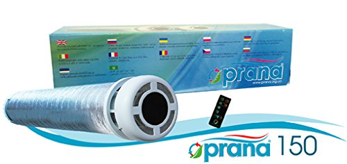

# Prana RC 

**DISCLAIMER: This library is under active development now. There are no any stable release yet, so please do not 
use it in your installation unless you are developer who would like to contribute into module**

Python library and CLI to manage Prana recuperators (https://prana.org.ua/) via BLE interface.
It provides access to the device API and provides functionality similar to functionality of the official mobile 
application with some limitations (see limitation section below).

**ATTENTION**: Manufacturer doesn't provide any technical documentation describing protocol and also officially doesn't 
provide an ability to interact with the devices programmatically. This library is based on reverse engineering of the 
closed proprietary protocol. Used it on your own risk.

# Hardware

Device running this software must be equipped with bluetooth 4.0+ module so it support BLE. 
This module relies on [Bleak](https://github.com/hbldh/bleak) library so there is a chance it might work on 
Win, Mac and Linux. However **it was tested exclusively on Linux**.

Most likely it is compatible with Prana 150,200G, and Eco Energy series (with limited feature set). 
But confirmed list of models which were verified to work fine is below:

* Prana 150

Please, create an ticket if you tested it with other device model so we could extend the list.

# Limitations

* Using device password is not supported
* Reading information form built-in sensors (for Eco Energy series) is not supported

# Credits
Dmitry Berezovsky

# Disclaimer
This module is licensed under GPL v3. This means you are free to use in non-commercial projects.

The GPL license clearly explains that there is no warranty for this free software. Please see the included LICENSE file for details.